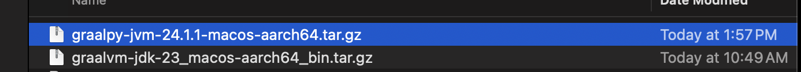
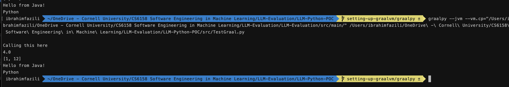

# LLM-Evaluation

## Testing with Graalvm and Graalpy

### Setting up the Graalvm and Graalpy

This is is a slightly complicated procedure and easy to get wrong (especially in the graalpy) so try to follow it step by step.

#### Graalvm

The first step is to install graalvm. This can be downloaded from here https://www.graalvm.org/downloads/# based on your platform and jdk version required. We used jdk 23.

Once this is done, you can follow the steps here https://www.graalvm.org/latest/getting-started/ and finish the install steps (extracting, exporting to path etc.)

### Graalpy

In order to call java code from python, it will require graalpy to be installed ontop of graalvm. You can download it from here https://github.com/oracle/graalpython/releases based on your platform and architecture. Two key notes

- you will need to download one that has the `-jvm` in the name in order to be compatible with the graalvm
- you will need to make sure that the release version is compatible with the graalvm you have. you can do this by searching for that specific version in release.

for reference, this is what Ibrahim has downloaded (he's running on an M1 Mac)

Once you have installed it, you can follow the steps here https://www.graalvm.org/latest/reference-manual/python/Python-Runtime/, specifically the alternative steps because you will be downloading it from Github releases.
For the export path, you can use the following command `export PATH=~/graalpy-24.1.1-macos-aarch64/bin:$PATH` and change it to match whichever graalpy you have installed and wherever you have kept the extracted file.

Once this is done, you can activate the virtual environment with the following command, `source LLM-Python-POC/graal-venv/bin/activate`

And to test that it works, you run `graalpy TestGraal.py` and it should work on a small code.

### Calling Java code in Python

To do this, you first need to compile the java classes you want with the `javac` command. 

Then you will need to add `import java` and `ClassNmae = java.type('packagename.ClassName')` to the top of the python file. 

Once this is done, you will need to run the following command,
`graalpy --jvm --vm.cp="/absolute/path/to/the/package/you/want" /absolute/path/to/the/python/file/to/run`

So the following is an example you can copy to try and have an idea on how to do it
 

Be warned, graalpy is very heavy and slow so don't be surprised if it takes more time than usual to execute the command

#### Calling classes that call one another

As an example, to run the `TaskManagerTestJava` you will need to run compile it a little differently because it requires the `lombok` library:

`javac -cp /Users/ibrahimfazili/.m2/repository/org/projectlombok/lombok/1.18.34/lombok-1.18.34.jar:. -processorpath /Users/ibrahimfazili/.m2/repository/org/projectlombok/lombok/1.18.34/lombok-1.18.34.jar Task.java TaskManager.java`

Then you can run it like the following:

`graalpy --jvm --vm.cp="/Users/ibrahimfazili/OneDrive - Cornell University/CS6158 Software Engineering in Machine Learning/LLM-Evaluation/LLM-Evaluation/src/main/" /Users/ibrahimfazili/OneDrive\ -\ Cornell\ University/CS6158\ Software\ Engineering\ in\ Machine\ Learning/LLM-Evaluation/LLM-Python-POC/test/TaskManagerTestJava.py`

## Running POC

To run the POC you will need to modify the following lines in `translation/execute_java_kc_local.sh`
- Line 7 -> this should be the path to the GraalVM JDK you installed earlier
- Line 10 -> this should be the absolute path to the `ConvertedCode/converted.txt` within the repository
- Lines 12 onward -> this should just be a simple replacement of the users with your to point to the right `.m2` directory on Macs.
- Additional note: if you need to run the Math POC you will need to update Line 18 with 'MathTestPython'

Then to run it (for Task + TaskManager) you can do the following
`#python3 translation/translate.py --files Task TaskManager --input_dir LLM-Evaluation/src/main/org/cornell/ --test_files TaskManagerTest --input_dir_test LLM-Evaluation/src/test/java/`

To run Math, you will need to update the args to be `... --files Math .... --test_files MathTest`

## Running on Apache Math

Apache Math is not included by default in the repository as it would be too large. You will need to clone it from here `https://github.com/apache/commons-math.git` in the main directory of the repository.

To run,

`python3 translation/translate.py --files AccurateMath AccurateMathCalc  --input_dir commons-math/commons-math-core/src/main/java/org/apache/commons/math4/core/jdkmath/ --test_files AccurateMathTest --input_dir_test ConvertedCode/ --sandbox 1`

The rest TBD
